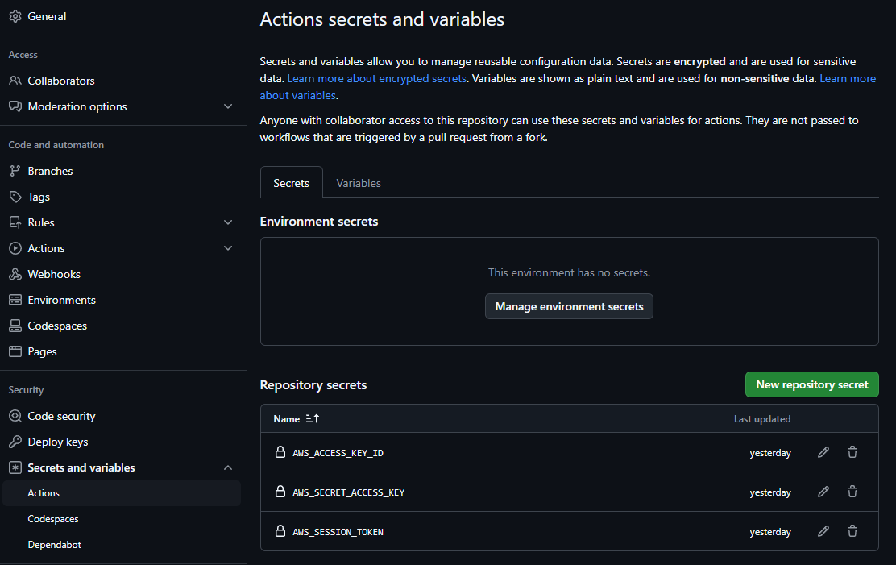

# CONFIGURATION

## Secrets

Use GitHub’s repository settings to securely store sensitive information in this case AWS Credentials

1. Navigate to Settings

2. On the left sidebar, select "Secrets and variables" > "Actions"

## Pipeline

1. Navigate to Actions

2. Either set up a workflow yourself or use a reconfigure workflow

3. Our setup include 2 workflows, one to deploy infrastructure [terraform.yml](.github/workflows/terraform.yml) and another one to destroy the infrastructure [destroy.yml](.github/workflows/destroy.yml)

## S3 & DynamoDB for backend

1. S3 used to store the state

- Navigate to S3 service > "Create Bucket"

- Choose a unique name for Bucket name

- Enable Bucket Versioning (optional)

2. DynamoDB used for state locking

- Navigate to DynamoDB service > "Create Table"

- Enter a name for table (e.g terraform-lock-table)

- Enter the partition key name (e.g LockID)

# USAGE

The [terraform.yml](../../.github/workflows/terraform.yml) workflow will trigger automatically if you make changes at LAB02-CICD/GithubActions

The [destroy.yml](../../.github/workflows/destroy.yml) workflow can trigger manually

By clicking Run workflow

# VERSION
AWS Provider Version 5.70.0

Terraform Version >= 1.0
